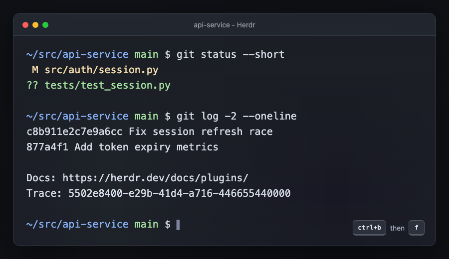

# Herdr Copy Hints

[](https://github.com/rotemb-wond/herdr-copy-hints/actions/workflows/test.yml)
[](https://github.com/rotemb-wond/herdr-copy-hints/releases/latest)
[](LICENSE)

Copy anything useful from a Herdr pane without reaching for the mouse. Copy
Hints places compact keyboard labels directly over paths, Git commits, URLs,
and identifiers, much like
[tmux-fingers](https://github.com/Morantron/tmux-fingers).



## Install

Install the latest release from GitHub:

```sh
herdr plugin install rotemb-wond/herdr-copy-hints
```

For a reproducible install, pin a release:

```sh
herdr plugin install rotemb-wond/herdr-copy-hints --ref v1.1.1
```

Add a keybinding to `~/.config/herdr/config.toml`:

```toml
[[keys.command]]
key = "prefix+f"
type = "plugin_action"
command = "rotemb-wond.copy-hints.open"
description = "show copy hints over the active pane"
```

Then reload Herdr:

```sh
herdr server reload-config
```

Requirements: Herdr 0.7.0 or newer, Python 3.10 or newer, and macOS or
Linux.

## Use

1. Press your shortcut, such as `ctrl+b`, then `f`.
2. Type the yellow label over the value you want.
3. The complete value is copied immediately.

When two-letter labels are needed, the first key highlights matching labels
in green and dims the rest. Press Escape or `ctrl+c` to cancel. The overlay
automatically redraws when the terminal is resized.

Copy Hints recognizes:

- File paths and `file:line:column` locations
- Git SHAs, remotes, branches, status paths, and diff paths
- HTTP, HTTPS, SSH, Git, and file URLs
- IPv4 addresses, UUIDs, hexadecimal values, and long numbers

Every visible occurrence receives a label. The overlay preserves pane layout,
ANSI colors, and Unicode character alignment.

## Configure

Configuration is optional. Find the stable plugin configuration directory:

```sh
herdr plugin config-dir rotemb-wond.copy-hints
```

Copy [`config.example.json`](config.example.json) to `config.json` in that
directory, then edit it. Changes take effect the next time you open Copy
Hints.

```json
{
  "enabled_patterns": ["url", "git", "sha", "path", "branch"],
  "hint_alphabet": "asdfghjkl",
  "custom_patterns": {
    "ticket": "TICKET-(?P<match>[0-9]+)"
  },
  "clipboard_command": ["pbcopy"]
}
```

The optional named regex group `match` copies only that group. Without it,
the complete custom match is copied. Available built-in pattern names are
`url`, `git`, `uuid`, `ip`, `hex`, `sha`, `path`, `branch`, and `number`.
See [`config.example.json`](config.example.json) for color settings and all
defaults.

## Clipboard support

On macOS, Copy Hints uses `pbcopy`. On Linux, it detects `wl-copy`, `xclip`,
or `xsel`. Remote sessions and systems without a clipboard command fall back
to OSC 52, copying through the attached terminal. Set `clipboard_command` to
override detection.

## Update or remove

Reinstalling a GitHub-managed plugin updates its managed checkout:

```sh
herdr plugin install rotemb-wond/herdr-copy-hints
```

To remove it:

```sh
herdr plugin uninstall rotemb-wond.copy-hints
```

Remove the `[[keys.command]]` block from your Herdr configuration after
uninstalling. Herdr keeps plugin configuration separate, so remove the
directory printed by `herdr plugin config-dir rotemb-wond.copy-hints` if you
also want to delete your settings.

## Contributing

Bug reports, pattern ideas, and pull requests are welcome. See
[`CONTRIBUTING.md`](CONTRIBUTING.md) for the development workflow and
[GitHub Discussions](https://github.com/rotemb-wond/herdr-copy-hints/discussions)
for questions and ideas.

## License

[MIT](LICENSE)
